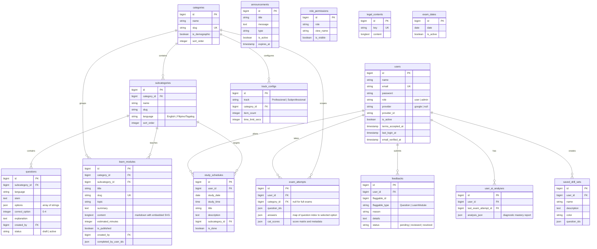

# CIVIO — Architecture & Technical Reference (Archived)

> **Archive Notice:** This document serves as the extended technical reference and architecture manual for CIVIO. For the primary user-facing documentation, quick-start guide, and feature highlights, refer to [README.md](file:///c:/Dev/laravel/cse_reviewer/README.md).

---

## Table of Contents

- [System Overview](#system-overview)
- [Architecture](#architecture)
- [Tech Stack](#tech-stack)
- [Features](#features)
- [Database Schema](#database-schema)
- [AI Integration](#ai-integration)
- [Security Architecture](#security-architecture)
- [Project Structure](#project-structure)
- [Environment Setup](#environment-setup)
- [Development Workflow](#development-workflow)
- [Deployment](#deployment)
- [Testing](#testing)

---

## System Overview

CIVIO is a single-page application (SPA) designed as an AI-augmented preparation platform for the Philippine Civil Service Examination (CSE). It provides role-based workspaces for both **Students/Users** and **Platform Administrators**.

### High-Level Architecture Diagram

```
┌─────────────┐     Inertia.js      ┌──────────────┐     Eloquent     ┌────────────┐
│  React SPA  │ ◄──── SSR/CSR ────► │  Laravel 13  │ ◄─────────────►  │ PostgreSQL │
│  (Frontend) │                     │  (Backend)   │                  │ (Database) │
└─────────────┘                     └──────┬───────┘                  └────────────┘
                                           │
                               ┌───────────┴───────────┐
                               ▼                       ▼
                         ┌──────────┐            ┌──────────┐
                         │  Gemini  │            │  Pusher  │
                         │   API    │            │ WebSocket│
                         └──────────┘            └──────────┘
```

1. **Users** register via email/password or Google OAuth, then launch full-length mock exams or targeted category drills.
2. **Exam attempts** record answers per item, time spent, and detailed category score breakdowns.
3. **AI Queue Jobs** run asynchronously via Laravel Queues (`database` driver) to batch-generate questions, create learning modules, and compute diagnostic reports.
4. **Real-time WebSockets** (Pusher / Laravel Echo) broadcast live notifications upon job completion or failure.
5. **Administrators** curate question banks, manage drafts, publish learning modules, oversee users, and configure dynamic role permissions.

---

## Architecture

### Monolithic SPA (Inertia.js Pattern)

The application adheres to the **Inertia.js monolith** pattern:
- **Server:** Laravel 13 handles routing, controllers, authorization, and validation.
- **Client:** React 19 renders typed components with zero REST/GraphQL boilerplate.
- **Data Transfer:** Controllers return `Inertia::render('page/name', $props)` with strictly-typed props.

### Design Patterns

| Pattern | Implementation |
|---|---|
| **MVC + Inertia** | Controllers render Inertia pages with typed view properties |
| **Form Requests** | Dedicated `FormRequest` classes for all mutations and filters (22 total) |
| **Service Layer** | `StudyPlanAnalyzer`, `ExamAttemptFormatter`, `DeterministicAnalysisService`, `TurnstileService` |
| **Job Queue** | Heavy AI generation operations dispatched as async queue jobs (`GenerateQuestionsJob`, `GenerateLearnModuleJob`, `GenerateUserAnalysisJob`) |
| **Event Broadcasting** | `AiGenerationCompleted`, `AiGenerationFailed`, `NewFeedbackSubmitted`, `LearnModulePublished` |
| **Model Observers** | Observers on `Category`, `Subcategory`, `Question`, `LearnModule`, `ExamDate` for automated cache invalidation |
| **Role-Based Access (RBAC)** | `EnsureUserIsAdmin` middleware + `RolePermission` database matrix for granular view gating |
| **Repository Caching** | High-performance `Cache::remember()` for shared taxonomy, announcements, and permissions |

### Request Lifecycle

```
HTTP Request
  → Global Middleware (Appearance, Active Check, Maintenance, CSRF, Cache Headers, Compression)
    → Route Middleware (auth, admin, throttle, turnstile, free.attempt)
      → Form Request Validation
        → Controller Logic / Service Layer
          → Inertia::render() / Redirect / JSON
            → React Hydration / Component Mounting
```

### Middleware Stack

| Middleware | Purpose |
|---|---|
| `HandleAppearance` | Persists user theme preference (light, dark, system) |
| `CheckUserActive` | Intercepts deactivated user accounts and redirects to `/account-inactive` |
| `CheckMaintenanceMode` | Custom maintenance barrier with administrative bypass |
| `HandleInertiaRequests` | Shares global props (auth user, role permissions, active announcements, Pusher config) |
| `SetCacheHeaders` | Generates ETags and Cache-Control headers for static view caching |
| `CompressResponse` | Applies Gzip compression on responses |
| `TransactionMiddleware` | Encloses mutation requests in database transactions |
| `CheckViewAccess` | Dynamic view-level permission control based on the `RolePermission` table |
| `EnsureUserIsAdmin` | Guards administrative endpoints |
| `AllowFreeAttempt` | Grants unauthenticated guests a single free mock exam session |
| `VerifyTurnstile` | Validates Cloudflare Turnstile CAPTCHA tokens |

---

## Tech Stack

### Backend
- **Language:** PHP 8.4
- **Framework:** Laravel 13
- **SPA Adapter:** Inertia.js Laravel v3
- **Authentication:** Laravel Fortify v1 (Password, 2FA, Passkeys) & Laravel Socialite v5 (Google OAuth)
- **Routing & Types:** Laravel Wayfinder v0
- **Real-Time:** Pusher Channels (`pusher/pusher-php-server` v7)
- **Testing & Tooling:** Pest PHP v4, PHPUnit v12, Laravel Pint v1

### Frontend
- **Framework:** React 19 & TypeScript 5.7
- **SPA Adapter:** `@inertiajs/react` v3
- **Styling:** Tailwind CSS v4, Lucide React icons, `tw-animate-css`
- **UI Components:** shadcn/ui + Radix UI (30+ accessible primitives)
- **Charts & Visualizations:** Recharts 3.8
- **Sanitization:** DOMPurify v3
- **Notifications:** Sonner v2
- **Compiler / Bundler:** Vite 8 + React Compiler Babel Plugin

### Database & Storage
- **Primary Database:** PostgreSQL 15+ (Neon / Supabase / Local)
- **Cache / Sessions / Queues:** Database-backed drivers for out-of-the-box zero-dependency hosting

### AI Services
- **Google Gemini API:** `gemini-3.7-flash`, `gemini-2.5-flash`, `gemini-1.5-pro` (Batch question generation, 5-part curriculum generation, exam post-mortem diagnostics)

---

## Features

### Public Features
- **Landing Page:** Interactive feature showcase, exam overview, and pricing/start CTAs.
- **Learn Center:** Searchable catalog of official study tutorials (`/learn` and `/learn/{slug}`).
- **Free Guest Attempt:** Single full-length mock exam session for unauthenticated visitors.
- **User Guide:** Tabbed platform onboarding walk-through (`/guide`).
- **Legal & Support:** Dynamic Terms of Service, Privacy Policy, and contextual Support form.
- **SEO Optimization:** Dynamic XML sitemap generator (`/sitemap.xml`).

### Authenticated User Features
- **Dashboard:** Activity heatmap, recent test history, passing accuracy rate, and smart study launchers.
- **Mock Exam Engine:** Professional (170 items, 190 mins) & Subprofessional (165 items, 160 mins) simulations with timed/untimed modes, palette navigation, item flagging, and scratchpads.
- **Focused Category Drills:** Custom practice sessions by category, subcategory, question count, and language.
- **Smart Weakness Drills:** 1-click drill creation targeting historical low-scoring subcategories.
- **Custom Question Builder & Saved Sets:** Create personalized practice items and bookmark custom question sets.
- **Scorecard & Answer Review:** Passing radar breakdown, detailed question rationales, and sanitized SVG visuals.
- **AI Diagnostic Report (`/analytics/ai-analysis`):** Pass probability percentage, mastery classifications (Mastered / Needs Practice / Critical Concern), time-to-readiness estimate, and 7-day study plan.
- **Study Calendar:** Drag-and-drop schedule planner with bulk reschedule today, bulk mark done, and AI study suggestions.
- **PDF Export Engine:** Rate-limited exam printable downloads.

### Administrator Features
- **Metrics Dashboard:** Real-time platform statistics (users, attempts, questions, modules, feedback).
- **Question Management:** Full CRUD with taxonomy hierarchy, bulk delete, bulk edit, and status toggle.
- **AI Question Generator:** Procedural SVG visual generators for Abstract Reasoning and Data Interpretation charts with Gemini.
- **Draft Staging Queue:** Review, edit, approve, and bulk-publish AI-generated questions.
- **Learn Module Management:** Markdown editor, reading time calculations, and Gemini module generation.
- **User Administration:** Role assignment (`admin` / `user`), account activation/deactivation, and deletion.
- **Syllabus Browser:** Reference view of CSC categories, subcategories, language rules, and demographic questions.
- **Exam Date Management:** Configure upcoming exam dates with dashboard countdown integration.
- **Announcement Banner System:** Global alert system with dismissibility and expiration timestamps.
- **Feedback Triage:** Polymorphic issue reporting management (`pending`, `reviewed`, `resolved`).
- **View Management Matrix:** Dynamic role-to-view visibility control.
- **System Maintenance Tools:** Cache flushing, route optimization, migration execution, and maintenance mode toggle.

---

## Database Schema



---

## AI Integration

### 1. Question Generation Pipeline (`GenerateQuestionsJob`)
- **Trigger:** Administrator clicks "Generate" on the Questions panel.
- **Provider:** Google Gemini API (`gemini-3.7-flash` / `gemini-2.5-flash`).
- **Features:**
  - 13 distinct subcategory prompt schemas reflecting official CSC guidelines.
  - Procedural SVG visual synthesis for Abstract Reasoning (matrices, sequences, cube folding, etc.).
  - Procedural SVG chart synthesis for Data Interpretation (bar, line, pie, comparative tables).
  - Structured output guaranteed via Gemini's `responseSchema`.
  - Concurrency lock per subcategory to prevent duplicate generations.
  - Saves in `draft` status for manual verification.

### 2. Learn Module Generation Pipeline (`GenerateLearnModuleJob`)
- **Trigger:** Administrator clicks "Generate" on the Learn Module panel.
- **Output:** Structured 5-part curriculum: Core Concept → Key Rules → Mental Shortcuts → Real-World Scenarios → Check Your Understanding (3 MCQs).
- **Illustrations:** Embedded SVG diagrams generated dynamically based on topic requirements.

### 3. User Diagnostic Engine (`GenerateUserAnalysisJob`)
- **Trigger:** Dispatched automatically upon exam attempt submission.
- **Input Data:** Historical scores, per-subcategory accuracy, time elapsed, and days until exam.
- **Output:** JSON diagnostic report containing pass probability, subject mastery tiers, readiness countdown, and a 7-day remediation plan.

---

## Security Architecture

| Layer | Implementation Details |
|---|---|
| **Input Validation** | 22 dedicated `FormRequest` classes; zero inline controller validation |
| **Mass Assignment** | Strict `$fillable` definitions on all Eloquent models |
| **Authentication** | Laravel Fortify (Passwords, 2FA, Passkeys) + Google OAuth via Socialite |
| **Authorization** | Role middleware (`admin`) + dynamic `RolePermission` verification via `CheckViewAccess` |
| **CSRF Defense** | Automatic CSRF token injection and verification on all web mutation routes |
| **Bot Protection** | Cloudflare Turnstile challenge token verification via `TurnstileService` |
| **Rate Limiting** | Strict throttle buckets: `global-views`, `global-mutations`, `ai-generation`, `pdf-export` |
| **XSS Prevention** | Client-side `DOMPurify` sanitization on all SVG/HTML rendering; custom validation rules (`NoHtml`, `NoUrls`, `NoProfanity`, `NoEmojis`) |
| **DB Transactions** | `TransactionMiddleware` wraps mutation requests in atomic transactions |
| **Model Strictness** | Eloquent strict mode enabled to eliminate lazy-loading (N+1 queries) |

---

## Project Structure

```
cse_reviewer/
├── app/
│   ├── Actions/Fortify/          # Fortify authentication actions
│   ├── Console/Commands/         # Artisan commands
│   ├── Events/                   # WebSocket broadcast events
│   ├── Http/
│   │   ├── Controllers/
│   │   │   ├── Admin/            # 12 admin controllers
│   │   │   ├── User/             # 9 user controllers
│   │   │   ├── Settings/         # Profile, security, preference controllers
│   │   │   ├── AuthController    # Google OAuth controller
│   │   │   ├── PublicController  # Static pages controller
│   │   │   ├── SitemapController # XML sitemap controller
│   │   │   └── SupportController # Support form controller
│   │   ├── Middleware/           # 13 custom middleware classes
│   │   └── Requests/            # 22 FormRequest validators
│   ├── Jobs/                     # 3 AI generation queue jobs
│   ├── Models/                   # 15 Eloquent models
│   ├── Observers/                # 5 cache-invalidation model observers
│   ├── Rules/                    # 5 custom validation rules
│   └── Services/                 # Business logic services
├── resources/js/
│   ├── components/
│   │   ├── ui/                   # 30+ shadcn/ui primitives
│   │   ├── domain/               # Domain-specific components
│   │   ├── layout/               # Sidebar, header, navigation, and page containers
│   │   ├── shared/               # Shared modals, guards, widgets, and skeletons
│   │   └── auth/                 # Authentication card components
│   ├── hooks/                    # Reusable React hooks
│   ├── layouts/                  # App, Auth, Settings layout wrappers
│   ├── pages/
│   │   ├── admin/                # Admin page modules (Questions, Learn, Users, etc.)
│   │   ├── user/                 # User page modules (Dashboard, Exams, Drills, Calendar, Analytics)
│   │   ├── public/               # Public pages (Landing, About, Terms, Support, Guide)
│   │   ├── auth/                 # Authentication views
│   │   └── settings/             # Settings views
│   ├── types/                    # Global TypeScript definitions
│   └── wayfinder/                # Auto-generated route functions
├── database/
│   ├── migrations/               # Database migrations
│   └── seeders/                  # Official CSC taxonomy seeders
├── tests/
│   ├── Feature/                  # Feature tests (Exams, Drills, Dashboard, AI, Auth)
│   └── Unit/                     # Unit tests
├── config/                       # Application configuration
├── routes/                       # Web, settings, channels, console routes
├── Dockerfile                    # Production container setup (PHP 8.4 + Nginx)
└── vite.config.ts                # Vite 8 + React Compiler + TailwindCSS v4
```

---

## Environment Setup

### Prerequisites
- PHP 8.4+ (extensions: `pdo_pgsql`, `mbstring`, `bcmath`, `fileinfo`, `gd`, `zip`)
- Composer 2.x
- Node.js 20+ & npm
- PostgreSQL 15+

### Installation Steps

```bash
# Clone the repository
git clone https://github.com/Vincenzo-OPC/Civio.git
cd hiraya-review

# Run the automated bootstrap script
composer setup
```

### Environment Configuration (`.env`)

```env
APP_NAME="CIVIO"
APP_ENV=local
APP_URL=http://localhost:8000

DB_CONNECTION=pgsql
DB_HOST=127.0.0.1
DB_PORT=5432
DB_DATABASE=cse_reviewer
DB_USERNAME=postgres
DB_PASSWORD=your_password

GEMINI_API_KEY=your_gemini_api_key_here

BROADCAST_CONNECTION=pusher
PUSHER_APP_ID=your_pusher_app_id
PUSHER_APP_KEY=your_pusher_app_key
PUSHER_APP_SECRET=your_pusher_app_secret
PUSHER_APP_CLUSTER=ap1
VITE_PUSHER_APP_KEY="${PUSHER_APP_KEY}"
VITE_PUSHER_APP_CLUSTER="${PUSHER_APP_CLUSTER}"

GOOGLE_CLIENT_ID=
GOOGLE_CLIENT_SECRET=
GOOGLE_REDIRECT=http://localhost:8000/auth/google/callback

TURNSTILE_SITE_KEY=
TURNSTILE_SECRET_KEY=
```

---

## Development Workflow

```bash
# Run server, queue listener, and Vite concurrently
composer run dev

# Code quality checks
npm run lint:check     # ESLint validation
npm run format:check   # Prettier validation
npm run types:check    # TypeScript compilation
vendor/bin/pint        # PHP style formatting

# Full CI validation suite
composer ci:check
```

---

## Deployment

The project builds as a self-contained container via `Dockerfile` on `serversideup/php:8.4-fpm-nginx`:

```bash
docker build -t hiraya-review .
docker run -p 8080:8080 --env-file .env hiraya-review
```

- Automated database migrations and cache optimizations run on boot via `scripts/00-laravel-deploy.sh`.
- Continuous integration is handled by GitHub Actions (`lint.yml` and `tests.yml`).

---

## Testing

```bash
# Run all Pest tests
php artisan test --compact

# Run filtered test
php artisan test --compact --filter=ExamAttemptTest
```

---

## License

This project is proprietary software. All rights reserved.
