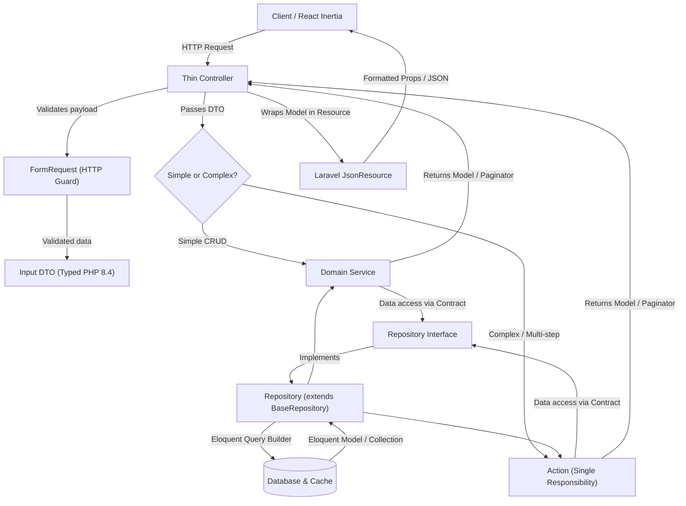

# Hiraya Review — Backend Architecture & Development Guide

This guide establishes the official backend architectural pattern for Hiraya Review: **Action-Repository-DTO + JsonResource**.

Whenever you are creating a new feature or refactoring an existing module, follow this 7-step sequence from start to finish.

---

## 1. Architectural Pipeline



---

## 2. Artisan Generator Commands (Cheat Sheet)

Use Laravel 13's built-in `make` commands to scaffold each layer quickly. Laravel automatically handles namespaces and creates subdirectories when you include the folder path:

| Layer | Built-in Artisan Command | Example Command |
|---|---|---|
| **Model & Migration** | `php artisan make:model -m` | `php artisan make:model ExamAttempt -m` |
| **Interface** | `php artisan make:interface` | `php artisan make:interface Repositories/ExamAttemptRepositoryInterface` |
| **Repository** | `php artisan make:class` | `php artisan make:class Repositories/ExamAttemptRepository` |
| **Input DTO** | `php artisan make:class` | `php artisan make:class DTOs/Exam/SubmitExamAttemptData` |
| **Domain Service** | `php artisan make:class` | `php artisan make:class Services/ExamAttemptService` |
| **Single Action** | `php artisan make:class` | `php artisan make:class Actions/Exam/SubmitExamAttemptAction` |
| **FormRequest** | `php artisan make:request` | `php artisan make:request StoreExamAttemptRequest` |
| **JsonResource** | `php artisan make:resource` | `php artisan make:resource ExamAttemptResource` |
| **Feature Test** | `php artisan make:test --pest` | `php artisan make:test --pest ExamAttemptTest` |

---

## 3. The 7-Step Implementation Sequence

```
1. Model & Migration ──► 2. Repository ──► 3. FormRequest & DTO ──► 4. JsonResource
                                                                            │
7. Tests & Pint   ◄── 6. Controller & Routes ◄── 5. Service / Action ◄──────┘
```

---

### Step 1: Model & Migration (Data Schema)

Define the database table, relationships, and strict type casts.

```bash
php artisan make:model YourEntity -m
```

#### Best Practices:
- Always declare strict types: `declare(strict_types=1);`.
- Explicitly define `$fillable` or `#[Fillable([...])]`.
- Cast attributes via `protected function casts(): array`.
- Define explicit relationship return types: `public function user(): BelongsTo`.

```php
namespace App\Models;

use Illuminate\Database\Eloquent\Attributes\Fillable;
use Illuminate\Database\Eloquent\Factories\HasFactory;
use Illuminate\Database\Eloquent\Model;
use Illuminate\Database\Eloquent\Relations\BelongsTo;

#[Fillable(['user_id', 'title', 'status', 'metadata'])]
class YourEntity extends Model
{
    use HasFactory;

    protected function casts(): array
    {
        return [
            'user_id' => 'integer',
            'metadata' => 'array',
        ];
    }

    public function user(): BelongsTo
    {
        return $this->belongsTo(User::class);
    }
}
```

---

### Step 2: Repository Layer (Data Access)

Encapsulate all SQL queries, eager loading, and query filters. Never write raw queries inside controllers or services.

#### 2.1 Interface (`app/Repositories/YourEntityRepositoryInterface.php`):
Inherit standard CRUD (`all`, `find`, `findOrFail`, `paginate`, `create`, `update`, `delete`) from `BaseRepositoryInterface`.

```php
namespace App\Repositories;

use Illuminate\Contracts\Pagination\LengthAwarePaginator;

interface YourEntityRepositoryInterface extends BaseRepositoryInterface
{
    public function paginateFiltered(array $filters, int $perPage = 10): LengthAwarePaginator;
}
```

#### 2.2 Implementation (`app/Repositories/YourEntityRepository.php`):
Extend `BaseRepository` to inherit all standard CRUD methods automatically.

```php
namespace App\Repositories;

use App\Models\YourEntity;
use Illuminate\Contracts\Pagination\LengthAwarePaginator;

class YourEntityRepository extends BaseRepository implements YourEntityRepositoryInterface
{
    public function __construct(YourEntity $model)
    {
        parent::__construct($model);
    }

    public function paginateFiltered(array $filters, int $perPage = 10): LengthAwarePaginator
    {
        $query = $this->model->newQuery()
            ->with(['user'])
            ->orderBy('id', 'desc');

        if (! empty($filters['status'])) {
            $query->where('status', $filters['status']);
        }

        if (! empty($filters['search'])) {
            $query->where('title', 'like', "%{$filters['search']}%");
        }

        return $query->paginate($perPage)->withQueryString();
    }
}
```

#### 2.3 Register Binding (`app/Providers/RepositoryServiceProvider.php`):
Bind the interface as a singleton:

```php
$this->app->singleton(
    YourEntityRepositoryInterface::class,
    YourEntityRepository::class
);
```

---

### Step 3: Input Boundary (FormRequest & DTO)

Separate HTTP validation from domain data transport.

#### 3.1 FormRequest (`app/Http/Requests/StoreYourEntityRequest.php`):
Authorizes the user and defines validation rules.

```bash
php artisan make:request StoreYourEntityRequest
```

```php
namespace App\Http\Requests;

use Illuminate\Foundation\Http\FormRequest;

class StoreYourEntityRequest extends FormRequest
{
    public function authorize(): bool
    {
        return true;
    }

    public function rules(): array
    {
        return [
            'title' => ['required', 'string', 'max:255'],
            'status' => ['required', 'string', 'in:active,draft'],
            'metadata' => ['nullable', 'array'],
        ];
    }
}
```

#### 3.2 Input DTO (`app/DTOs/YourEntity/UpsertYourEntityData.php`):
An immutable, transport-agnostic PHP 8.4 `readonly` object.

```php
namespace App\DTOs\YourEntity;

use App\Http\Requests\StoreYourEntityRequest;

readonly class UpsertYourEntityData
{
    public function __construct(
        public string $title,
        public string $status,
        public array $metadata = [],
        public ?int $userId = null,
    ) {}

    public static function fromStoreRequest(StoreYourEntityRequest $request): self
    {
        $v = $request->validated();

        return new self(
            title: (string) $v['title'],
            status: (string) ($v['status'] ?? 'draft'),
            metadata: (array) ($v['metadata'] ?? []),
            userId: $request->user()?->id,
        );
    }

    public function toArray(): array
    {
        return [
            'title' => $this->title,
            'status' => $this->status,
            'metadata' => $this->metadata,
            'user_id' => $this->userId,
        ];
    }
}
```

---

### Step 4: Output Boundary (Laravel JsonResource)

Transforms Eloquent models into formatted payloads for Inertia or JSON APIs.

```bash
php artisan make:resource YourEntityResource
```

```php
namespace App\Http\Resources;

use Illuminate\Http\Request;
use Illuminate\Http\Resources\Json\JsonResource;

/**
 * @mixin \App\Models\YourEntity
 */
class YourEntityResource extends JsonResource
{
    public function toArray(Request $request): array
    {
        return [
            'id' => $this->id,
            'title' => $this->title,
            'status' => strtoupper($this->status),
            'user_name' => $this->whenLoaded('user', fn () => $this->user?->name),
            'metadata' => $this->metadata ?? [],
            'created_at' => $this->created_at?->toIso8601String(),
        ];
    }
}
```

---

### Step 5: Business Logic (Service or Action)

- **Use a Service (`app/Services/YourEntityService.php`)**: For standard domain operations (CRUD, fetching with relations, cache flushing).
- **Use an Action (`app/Actions/YourEntity/PublishEntityAction.php`)**: For heavy, multi-step operations (concurrency locks, multi-table transactions, notifications).

```php
namespace App\Services;

use App\DTOs\YourEntity\UpsertYourEntityData;
use App\Models\YourEntity;
use App\Repositories\YourEntityRepositoryInterface;
use Illuminate\Contracts\Pagination\LengthAwarePaginator;

class YourEntityService
{
    public function __construct(
        protected YourEntityRepositoryInterface $repository
    ) {}

    public function getEntity(int|string $id): YourEntity
    {
        /** @var YourEntity */
        return $this->repository->findOrFail($id, relations: ['user']);
    }

    public function getPaginatedEntities(array $filters, int $perPage = 10): LengthAwarePaginator
    {
        return $this->repository->paginateFiltered($filters, $perPage);
    }

    public function createEntity(UpsertYourEntityData $data): YourEntity
    {
        /** @var YourEntity */
        return $this->repository->create($data->toArray());
    }

    public function deleteEntity(int|string $id): bool
    {
        return $this->repository->delete($id);
    }
}
```

---

### Step 6: HTTP Transport (Thin Controller & Routes)

Controllers only orchestrate: `FormRequest -> DTO -> Service/Action -> JsonResource`.

```php
namespace App\Http\Controllers\Admin;

use App\DTOs\YourEntity\UpsertYourEntityData;
use App\Http\Requests\StoreYourEntityRequest;
use App\Http\Resources\YourEntityResource;
use App\Services\YourEntityService;
use Illuminate\Http\Request;
use Inertia\Inertia;

class YourEntityController
{
    public function __construct(
        protected YourEntityService $service
    ) {}

    public function index(Request $request)
    {
        $perPage = min(50, max(5, (int) $request->input('per_page', 10)));
        $paginator = $this->service->getPaginatedEntities($request->all(), $perPage);

        return Inertia::render('admin/entity/index', [
            'entities' => YourEntityResource::collection($paginator)->resolve(),
            'pagination' => [
                'current_page' => $paginator->currentPage(),
                'per_page' => $paginator->perPage(),
                'total' => $paginator->total(),
                'last_page' => $paginator->lastPage(),
            ],
            'filters' => $request->only(['search', 'status']),
        ]);
    }

    public function show(string $id)
    {
        $entity = $this->service->getEntity($id);

        return Inertia::render('admin/entity/show', [
            'entity' => (new YourEntityResource($entity))->resolve(),
        ]);
    }

    public function store(StoreYourEntityRequest $request)
    {
        $dto = UpsertYourEntityData::fromStoreRequest($request);
        $entity = $this->service->createEntity($dto);

        return redirect()->route('entity.show', $entity->id)
            ->with('success', 'Created successfully.');
    }
}
```

---

### Step 7: Verification & Formatting (Tests & Pint)

1. **Write Pest Feature Test** (`tests/Feature/Admin/YourEntityManagementTest.php`):
   ```bash
   php artisan make:test --pest YourEntityManagementTest
   ```
2. **Run Tests**:
   ```powershell
   php artisan test --compact --filter=YourEntityManagementTest
   ```
3. **Format Code**:
   ```powershell
   vendor/bin/pint --format agent
   ```

---

### Step 8: Legacy Code Cleanup & Safe File Deletion

When refactoring an existing module from legacy code into the **Action-Repository-DTO + JsonResource** architecture:

1. **Identify Superseded Files**: Look for old controllers, redundant traits, obsolete service providers, deprecated helper classes, or custom query wrappers whose responsibilities were completely absorbed by new Actions, Services, DTOs, or Repositories.
2. **Audit Workspace Usages**: Before deleting, search the entire project to verify no other classes, background jobs, console commands, or tests reference the old file:
   ```powershell
   git grep "OldClassName"
   ```
3. **Safely Delete Obsolete Files**: Remove the dead file so the codebase stays clean and no unused code or conflicting logic lingers:
   ```powershell
   Remove-Item app/Services/LegacyOldService.php
   ```
4. **Document in Module Checklist & Git Commit**: Explicitly record removed files in the module checklist (`Obsolete Files Cleaned Up`) and in git commit descriptions so team members and reviewers clearly see there are no unused files left behind.

---

## 4. Architecture Rules & Anti-Patterns to Avoid

| ❌ Anti-Pattern | ✅ Correct Way |
|---|---|
| Inline validation in controllers (`$request->validate(...)`) | Dedicated `FormRequest` class |
| Passing a `FormRequest` into a Service or Action | Pass a strongly typed **Input DTO** |
| Writing Eloquent queries (`Model::where(...)`) in Controllers | Write query methods in a **Repository** |
| Duplicating array transformations across `show()`, `edit()`, and `index()` | Use a single **Laravel `JsonResource`** |
| Splitting a fat class into arbitrary traits | Use **Single-Responsibility Actions** |
| Using empty constructors or untyped parameters | Constructor promotion and explicit PHP 8.4 scalar types |
| Leaving unused or superseded legacy files after refactoring | Safely delete obsolete files once their logic is absorbed and verified with zero usages |
| Keeping dead imports or orphaned service providers | Unregister from `bootstrap/providers.php` and delete orphaned classes |

---

## 5. Module Modernization Progress & Checklist

Track the application of the **Action-Repository-DTO + JsonResource** pattern across the codebase:

### ✅ 1. Question Module (Status: COMPLETED)
- [x] `app/Repositories/BaseRepositoryInterface.php` & `BaseRepository.php`
- [x] `app/Repositories/QuestionRepositoryInterface.php` & `QuestionRepository.php`
- [x] `app/DTOs/Question/UpsertQuestionData.php`
- [x] `app/Http/Resources/QuestionResource.php`
- [x] `app/Actions/Question/BulkUpdateQuestionsAction.php`
- [x] `app/Services/QuestionService.php`
- [x] `app/Providers/RepositoryServiceProvider.php` (IoC binding)
- [x] `app/Http/Controllers/Admin/QuestionController.php` (Refactored)
- [x] `tests/Feature/Admin/QuestionManagementTest.php` (Verified)
- [x] **Obsolete Files Cleaned Up**: None (Clean migration)

---

### ✅ 2. Exam & Attempt Module (Status: COMPLETED)
*Target: Refactor attempt submissions, scorecard views, and retake logic.*
- [x] **Repositories**: `ExamAttemptRepositoryInterface.php` & `ExamAttemptRepository.php`
- [x] **Input DTOs**: `app/DTOs/Exam/SubmitExamAttemptData.php`, `SubmitExamAttemptResult.php`
- [x] **JsonResources**: `app/Http/Resources/ExamAttemptResource.php`, `ExamScorecardResource.php`, `AdminExamAttemptResource.php`
- [x] **Actions**: `app/Actions/Exam/SubmitExamAttemptAction.php` (concurrency lock + guest check + DB transaction)
- [x] **Services**: `app/Services/ExamAttemptService.php`
- [x] **Controllers Refactored**: 
  - `app/Http/Controllers/User/ExamController.php`
  - `app/Http/Controllers/User/ExamHistoryController.php`
  - `app/Http/Controllers/Admin/AttemptController.php`
- [x] **Tests Verified**: `tests/Feature/ExamAttemptTest.php` & `GuestFreeExamTest.php` (14/14 passing)
- [x] **Obsolete Files Cleaned Up**: Removed redundant provider registration in `bootstrap/providers.php`

---

### ✅ 3. Learn Curriculum Module (Status: COMPLETED)
*Target: Refactor learning tutorials, drafts, syllabus viewer, and module publishing.*
- [x] **Repositories**: `LearnModuleRepositoryInterface.php` & `LearnModuleRepository.php`
- [x] **Input DTOs**: `app/DTOs/Learn/UpsertLearnModuleData.php`
- [x] **JsonResources**: `app/Http/Resources/LearnModuleResource.php`, `AdminLearnModuleResource.php`, `AdminDraftModuleResource.php`
- [x] **Actions**: `app/Actions/Learn/BulkUpdateLearnModulesAction.php`
- [x] **Services**: `app/Services/LearnModuleService.php`
- [x] **Controllers Refactored**:
  - `app/Http/Controllers/Admin/LearnController.php`
  - `app/Http/Controllers/User/LearnController.php`
- [x] **Tests Verified**: `tests/Feature/Admin/LearnModuleManagementTest.php` (7/7 passing)
- [x] **Obsolete Files Cleaned Up**: None (Clean architectural migration)

---

### ✅ 4. Study Schedule & Calendar Module (COMPLETED)
*Target: Refactor study calendar, shift date arithmetic, and bulk task updates.*
- [x] **Repositories**: `StudyScheduleRepositoryInterface.php` & `StudyScheduleRepository.php`
- [x] **Input DTOs**: `app/DTOs/StudySchedule/UpsertStudyScheduleData.php`, `ShiftScheduleData.php`
- [x] **JsonResources**: `app/Http/Resources/StudyScheduleResource.php`
- [x] **Actions**: 
  - `app/Actions/StudySchedule/ShiftStudyScheduleAction.php`
  - `app/Actions/StudySchedule/BulkUpdateStudyScheduleAction.php`
- [x] **Services**: `app/Services/StudyScheduleService.php`
- [x] **Controllers to Refactor**:
  - `app/Http/Controllers/User/StudyScheduleController.php`
  - `app/Http/Controllers/User/StudySuggestionController.php`
- [x] **Tests Verified**: `tests/Feature/User/StudyScheduleManagementTest.php` (5/5 passing, 26/26 feature suite)
- [x] **Obsolete Files Cleaned Up**: None (Replaced controller private formatters with StudyScheduleResource)

---

### ✅ 5. Drills & Custom Practice Sets (Status: COMPLETED)
*Target: Refactor smart weakness drills, saved practice sets, and custom items.*
- [x] **Repositories**: `SavedDrillSetRepositoryInterface.php` & `SavedDrillSetRepository.php`
- [x] **Input DTOs**: `app/DTOs/Drill/UpsertSavedDrillSetData.php`, `StoreCustomQuestionData.php`, `BookmarkQuestionData.php`
- [x] **JsonResources**: `app/Http/Resources/SavedDrillSetResource.php`, `DrillQuestionResource.php`
- [x] **Services**: `app/Services/DrillService.php`
- [x] **Controllers Refactored**:
  - `app/Http/Controllers/User/DrillController.php`
  - `app/Http/Controllers/User/SavedDrillSetController.php`
- [x] **Tests Verified**: `tests/Feature/User/DrillManagementTest.php` (5/5 passing, 12/12 drill suite)
- [x] **Obsolete Files Cleaned Up**: None (Unified inline duplicate question formatting across 4 controllers into DrillQuestionResource)

---

### ⏳ 6. Analytics & Readiness Engine (Priority: Medium)
*Target: Isolate analytics metrics calculation, eliminate memory hazards, and decouple diagnostic engine.*
- [ ] **Input DTOs**: `app/DTOs/Analytics/AnalyticsFilterData.php`
- [ ] **JsonResources**: `app/Http/Resources/AnalyticsMetricsResource.php`, `ReadinessReportResource.php`
- [ ] **Services**: Refactor `app/Services/AnalyticsService.php` & decompose `DeterministicAnalysisService.php`
- [ ] **Controllers to Refactor**:
  - `app/Http/Controllers/User/AnalyticsController.php`
  - `app/Http/Controllers/User/DashboardController.php`
- [ ] **Obsolete Files Cleaned Up**: (List any removed legacy files or "None")

---

### ⏳ 7. Admin Operations & Platform Communications (Priority: Low-Medium)
*Target: Standardize announcements, user feedback triage, user administration, and support.*
- [ ] **Repositories**: `AnnouncementRepository.php`, `FeedbackRepository.php`, `UserRepository.php`
- [ ] **Input DTOs**: `UpsertAnnouncementData.php`, `UpdateUserData.php`, `SupportMessageData.php`
- [ ] **JsonResources**: `AnnouncementResource.php`, `FeedbackResource.php`, `AdminUserResource.php`
- [ ] **Services**: `AnnouncementService.php`, `FeedbackService.php`, `UserService.php`, `SupportService.php`
- [ ] **Controllers to Refactor**:
  - `app/Http/Controllers/Admin/AnnouncementController.php`
  - `app/Http/Controllers/Admin/FeedbackController.php`
  - `app/Http/Controllers/Admin/UserController.php`
  - `app/Http/Controllers/Public/SupportController.php`
- [ ] **Obsolete Files Cleaned Up**: (List any removed legacy files or "None")
